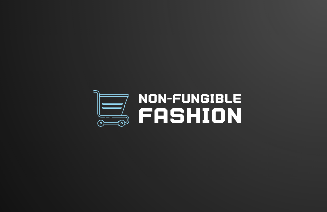

# Non_Fungible_Fashion

# Introduction

This app provides a Streamlit based user interface where the  user gets to choose between multiple items and this app mints a Non Fungible Token with the purchase of a physical product. The NFT is then transferred to user defind wallet address. 

This project has a Streamlit UI to buy designer products which mints a Non Fungible Token (NFT) as proof of ownership generated with the purchase of that product. The NFT transfers to the users specified wallet address. 

# Requirements

## Streamlit

Website: https://streamlit.io/  
Documentation: https://docs.streamlit.io/  
To install streamlit run pip install streamlit  

Before you get started, you're going to need a few things: 

   *Your favorite IDE or text editor  
   *Python 3.7 - Python 3.10  
   *PIP  

## Solidity

*Website: https://soliditylang.org/  
*Documentation: https://docs.soliditylang.org/en/v0.8.17/  

## Non Fungible Tokens

Website:   
Documentation: https://docs.streamlit.io/  
To install streamlit run pip install streamlit  

## IPFS and Piniata

